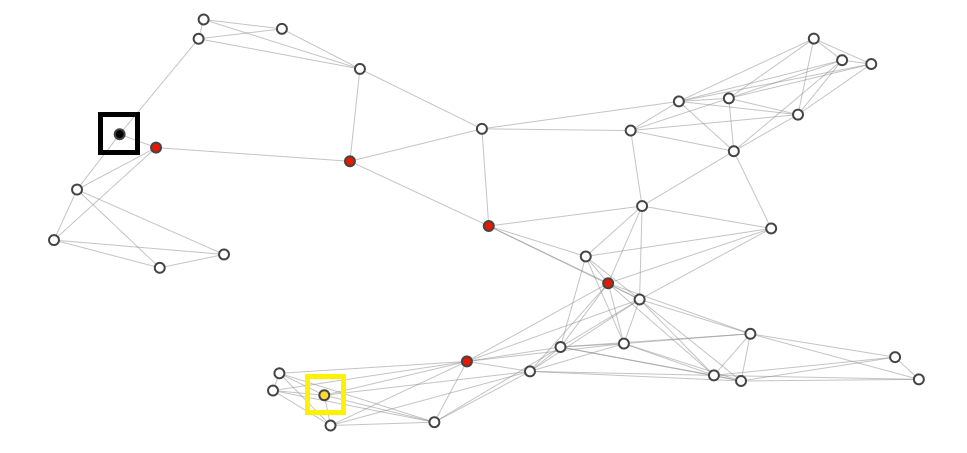

# A\* Route Planner Using Advanced Data Structures
Implementation of A\* search:  "Google-maps" style route planning algorithm.  

### PathPlanner class

`__init__` - The planner is initailzied with a map, M, and typically a start and goal node. If either of these are `None`, the rest of the variables here are also set to none. 
- `closedSet` includes any explored/visited nodes. 
- `openSet` are any nodes on our frontier for potential future exploration. 
- `cameFrom` will hold the previous node that best reaches a given node
- `gScore` is the `g` in our `f = g + h` equation, or the actual cost to reach our current node
- `fScore` is the combination of `g` and `h`, i.e. the `gScore` plus a heuristic; total cost to reach the goal
- `path` comes from the `run_search` function..

`reconstruct_path` - This function just rebuilds the path after search is run, going from the goal node backwards using each node's `cameFrom` information.

`_reset` - Resets the initialized variables for PathPlanner except the map, start and goal variables.

`run_search` -  The method checks whether the map, goal and start have been added to the class. Then, it will also check if the other variables, other than `path` are initialized.`is_open_empty`, is used to check whether there are still nodes to explore. If the goal is reached, it reconstruct the path. If not, th current node from the frontier (`openSet`) and into explored (`closedSet`). Then, we check out the neighbors of the current node, check out their costs, and plan our next move.

## Requirements 

To run this notebook, you will need:

1. Python 3
2. [Jupyter notebook](http://jupyter.readthedocs.io/en/latest/install.html)
3. [networkx](https://networkx.github.io/documentation/latest/install.html)
4. [plotly](https://plot.ly/python/getting-started/#installation)
