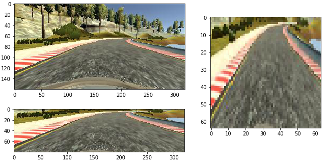

# Behavior Cloning for Autonomous Driving

**Files:**
* model_sim.py : script used to create and train the model
* preprocess_sim_data.py : cleans up and augments the dataset
* drive_adaptive.py : script to drive the car using [Udacity simulator](https://github.com/udacity/self-driving-car-sim)
* model.h5: trained Keras model
* /sim_data/sim_data.p : pickle file containing the image paths and control commands

[Full video](https://youtu.be/BdA-vUNc-Nc)

**Approach:** The approach taken in this work is to use a convolutional neural network to predict steering commands required to keep the car in the lane using images taken from the center of the car. Instead of predicting all control commands, only the steering command is predicted, and the throttle is defined as a function of the steering command.

**Dataset Exploration:** The original dataset consists of  8036,  160x320x3 images taken from a camera positioned at the center of the car.  Additionally, there are 8036 images taken from a camera facing the left-side of the camera and, 8036 images taken from a camera facing the right-side of the camera -- total of 24108 images. The steering, throttle, and brake parameters are saved in a csv file named _driving\_log.csv_.  The csv file has the path to the center, left and right images; steering, throttle, brake, and speed values.

Figure 1: Pictures taken from left, center, and right-side cameras

**Data augmentation:**

The [original dataset](https://github.com/udacity/CarND-Behavioral-Cloning-P3) has a strong bias towards driving straight. There are also more left turns than right turns. I originally collected data by driving on the track in the opposite direction to obtain more right turn and recovery data. Driving smoothly with a keyboard was rather difficult.The collected data resulted in the car going off track at high speeds.  Throttle is an important parameter. The car may not be able to do a turn that it can easily make at a low speed, if it&#39;s driving at high speed.  Therefore, I decided to use the original data set, augment the data, and develop controls for the throttle separately.

 The following operations were performed in _preprocess\_sim\_data.py_ to augment the dataset:

- A moving average filter with a window size of 3 was used to smoothen out the data.
- 80% of the center images with straight steering commands were ignored.
- A steering correction was applied to all left and right images
  - _Left\_image: steering\_command= steering\_command+correction_
  - _Righ\_image: steering\_command= steering\_command-correction_

I experimented with a correction value between the range 0.15-0.35. Correction values greater than 0.25 performed better. I ended up choosing 0.35 to provide more steering during turns.

- A dictionary was defined to store the path to each image, and the corresponding steering commands in a pickle file _sim\_data.p_.

Here&#39;s what the distribution looks like after augmentation:

Figure 2: Distribution of steering commands before and after augmentation

**Model Architecture:** There are 3 networks implemented in _model\_sim.py_.  TestNetwork() is a simple network that was used just to debug the rest of the code. I experimented with two networks developed for end-to-end training: Comma.AI[1]and NvidiaNet[2] and experimented with different image sizes.NvidiaNet had the minimal loss after a fixed amount of epochs. NvidiaNet expects an input size of 66x200. The network struggled with the first  right turn after the bridge and the car did the turn over the red stripes. When I changed the image size to 64x64 as suggested in [3], the network performed great. It&#39;s interesting to note that the rezising to 64x64 image  is similar to applying a perspective transform. If the network were to fail, I was going to try applying a perspective transform to the input set similar to the Advanced Lane Finding project.

Figure 3: Model Architecture

- **Prepocessing:** I decided to implement all the preprocessing in a Lambda layer to make the code more compact and avoid changing the simulator code by adding a preprocessing step during runtime. I used _resize\_normalize()_ to resize and normalize the image inside a lambda layer. To play nice with keras, I had to import tensorflow.resize\_image inside _resize\_normalize()_ and define the function inside _NvidiaNet()_ , which defines the model network. This fix was suggested in [4]. Before the Lambda layer, the images were cropped 60 pixels from the top to remove the sky and trees, and 20 pixels from the bottom to remove the hood.

Figure 4: Preprocessing steps

- **Dropouts** : I added spatial dropouts after convolution layers and dropouts after fully-connected (dense) layers as a regularization method to reduce overfitting.

- **Generators:** The dataset is quite large and would take substantial amount of time to import and train. There are over half a million parameters. Therefore, a data generator was used to load batches of data in runtime. This also allows performing data augmentation on the fly.  _train\_batch\_generator()_ function takes the image path and steering commands of the training set as input,  picks a random batch of training set, and augments the batch by flipping the images and the steering commands. Then, the generator yields the batch and feeds it to the network in batches via _model.fit\_generator_. The process continues until all training set is consumed.

- **Training:** The dataset was divided to 80% training set, and 20% validation set. I used 20 epochs and a batch size of 32. I used Adam optimizer. The default learning rate lr=1e-03 was resulting in zig-zag driving behavior. Increasing the learning rate to lr=1e-04 resulted in superior performance. Similarly, increasing the number of epochs from 10 to 20 made the driving much smoother.

Figure 5: Model loss

**Visualizing layers:** _visualize\_network.py_ can be used to visualize the output of each layer. The keras code was adapted from the snippet in [5]. I was unable to visualize the layers because my model imports keras inside the model definition (the fix that was required in the preprocessing step of the network). So I also trained NvidiaNet without the resizing operation and used the original 66x200 image size used in the paper to visualize the layers. Note that this image size was only used to understand what the network learns and not used in the final implementation. Look at the output of the layers: No need for Hough line detection anymore!

 Figure 6: Output of Conv1
 

Figure 7: Output of Conv2

**Adaptive Throttle:** I tested the simulation at the default speed of _9 mph_ and _20 mph_. They both work great. _drive\_adaptive.py_ uses a moving average over the steering commands and sets the throttle as a function of the steering command. The throttle function was taken from [6].

**Test Results:** Certainly drives better than me. _video.mp4_ shows the center camera images from the test run.

**Next Steps:** The network is not robust in track 2. People seem to have had good results in track 2 by collecting data with a joystick and augmenting the images with translation, rotation, shadows, etc.  I spent a good amount of time on this project this week, so I&#39;ll defer that to a later time. Overall, I had a lot of fun working on this project!

**References:**

_[1]_  https://github.com/commaai

_[2]_ Bojarski, Mariusz, et al. &quot;End to end learning for self-driving cars.&quot; arXiv preprint arXiv:1604.07316 (2016).

_[3]_ https://chatbotslife.com/using-augmentation-to-mimic-human-driving-496b569760a9_

_[4]_ https://github.com/keras-team/keras/issues/5298_

_[5]_ https://github.com/windowsub0406/Behavior-Cloning

_[6]_ https://github.com/ctsuu/Behavioral-Cloning/blob/master/drive.py
