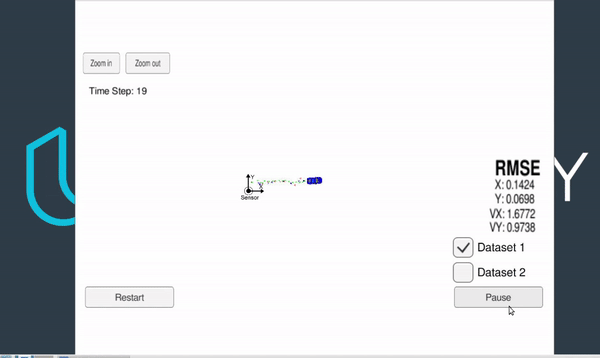

# Sensor Fusion for Pedastrian Tracking: EKF vs IEKF 
This code implements a sensor fusion framework to track a pedastrian using lidar and radar measurements of a car.

## Implementation

The implementation uses a kalman filter to estimate the position and velocity of the pedastrian. 
The motion model of the pedastrian is assumed to be linear.The measurement model for LIDAR is a linear function of the state, whereas the measurement model for radar is a nonlinear funtion of the state.

For LIDAR, kalman filter update equations were used. For radar, an extended kalman filter was implemented and the measurement model was linearized. For highly nonlinear functions such as this application, where we estimate the pose, the extended kalman filter can significantly underestimate the covariance. If the estimated state is not close the the true state, the first-order approximation will no longer be a good approximation. To alleviate this, an iterated-extended kalman filter can be used.The main difference between EKF and IEKF is the measurement update step. IEKF iterates over the measurement update step for a fixed number of iterations (i=1,2,...,n) or until a stopping criterion is met. Innovation, defined as y-h(x), was used as a stopping criterion. It's important to note that, the state covariance matrix is kept fixed during this iterative step and only the state estimate is iterated. If we were to also update the  covariance matrix, it would mean we process two identical measurements.

Please see[1]  for the mathematical formulation of the Kalman Filter (KF), Extended Kalman Filter (EKF) and Iterated Extended Kalman Filter(IEKF).The implementation here follows the same notation.

A high-level flow chart of the implementation is below:

## Results

The results with EKF and IEKF are below. Lidar measurements are shown in with a red circle, radar measurements are shown with blue circles. Green markers show the estimated position of the car by the sensor fusion algorithm.
Looking at the RMSE values, note that IEKF noticebly performs better especially in velocity prediction.

EKF:

IEKF:

## Files

Important files of the project are listed below:

**/src**
- FusionEKF.cpp
    - initializes the filter, calls the predict function, calls the update function. You can comment/uncomment lines 133/134 to select EKF or IEKF.
- Kalman_filter.cpp
    - implementation of **Predict** and **Update** steps of KF, EKF and IEKF
- main.cpp
   - communicates with the Udacity Simulator receiving data measurements, calls a function to run the Kalman filter, calls a function to calculate RMSE
- tools.cpp
   - Calculation of RMSE and the jacobian matrix of the radar measurement for EKF and IEKF 
- /Eigen
   - Eigen library for matrix and vector operations

**/data**
-  **obj_pose-laser-radar-synthetic-input.txt** contains LASER and RADAR sensor measurements.
For a row containing radar data, the columns are: sensor_type, rho_measured, phi_measured, rhodot_measured, timestamp, x_groundtruth, y_groundtruth, vx_groundtruth, vy_groundtruth, yaw_groundtruth, yawrate_groundtruth.
For a row containing lidar data, the columns are: sensor_type, x_measured, y_measured, timestamp, x_groundtruth, y_groundtruth, vx_groundtruth, vy_groundtruth, yaw_groundtruth, yawrate_groundtruth.

**Input**: values provided by the simulator to the c++ program

["sensor_measurement"] => the measurement that the simulator observed (either lidar or radar)

**Output*: values provided by the c++ program to the simulator

["estimate_x"] <= kalman filter estimated position x

["estimate_y"] <= kalman filter estimated position y

["rmse_x"]

["rmse_y"]

["rmse_vx"]

["rmse_vy"]

**Data Collection**:

If you'd like to generate your own radar and lidar data, see the
[utilities repo](https://github.com/udacity/CarND-Mercedes-SF-Utilities) for
Matlab scripts that can generate additional data.

## Dependencies

* cmake >= 3.5
  * All OSes: [click here for installation instructions](https://cmake.org/install/)
* make >= 4.1 (Linux, Mac), 3.81 (Windows)
  * Linux: make is installed by default on most Linux distros
  * Mac: [install Xcode command line tools to get make](https://developer.apple.com/xcode/features/)
  * Windows: [Click here for installation instructions](http://gnuwin32.sourceforge.net/packages/make.htm)
* gcc/g++ >= 5.4
  * Linux: gcc / g++ is installed by default on most Linux distros
  * Mac: same deal as make - [install Xcode command line tools](https://developer.apple.com/xcode/features/)
  * Windows: recommend using [MinGW](http://www.mingw.org/)
  
To run the project in Udacity simulator, please follow the instructions [here](https://github.com/udacity/self-driving-car-sim/releases).  

## References

_[1]_  Havlík, Jindřich, and Ondřej Straka. "Performance evaluation of iterated extended Kalman filter with variable step-length." Journal of Physics: Conference Series. Vol. 659. No. 1. IOP Publishing, 2015.
