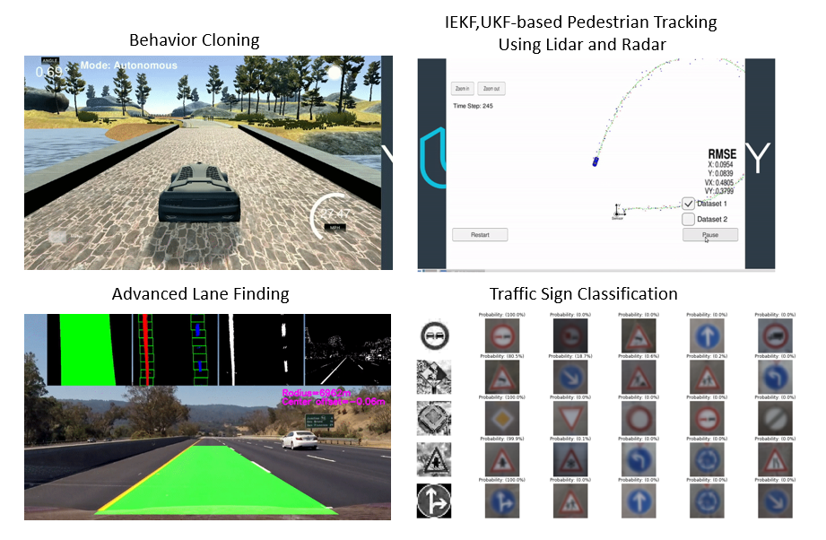

# Self-Driving-Car-Nanodegree
This repository contains material related to [Udacity's Self Driving Car Nanodegree program](https://www.udacity.com/course/self-driving-car-engineer-nanodegree--nd013) (2018-2019).



## Installation

**Download** the latest version of `miniconda` that matches your system.

**NOTE**: There have been reports of issues creating an environment using miniconda `v4.3.13`. If it gives you issues try versions `4.3.11` or `4.2.12` from [here](https://repo.continuum.io/miniconda/).

|        | Linux | Mac | Windows | 
|--------|-------|-----|---------|
| 64-bit | [64-bit (bash installer)][lin64] | [64-bit (bash installer)][mac64] | [64-bit (exe installer)][win64]
| 32-bit | [32-bit (bash installer)][lin32] |  | [32-bit (exe installer)][win32]

[win64]: https://repo.continuum.io/miniconda/Miniconda3-latest-Windows-x86_64.exe
[win32]: https://repo.continuum.io/miniconda/Miniconda3-latest-Windows-x86.exe
[mac64]: https://repo.continuum.io/miniconda/Miniconda3-latest-MacOSX-x86_64.sh
[lin64]: https://repo.continuum.io/miniconda/Miniconda3-latest-Linux-x86_64.sh
[lin32]: https://repo.continuum.io/miniconda/Miniconda3-latest-Linux-x86.sh

**Install** [miniconda](http://conda.pydata.org/miniconda.html) on your machine. Detailed instructions:

- **Linux:** http://conda.pydata.org/docs/install/quick.html#linux-miniconda-install
- **Mac:** http://conda.pydata.org/docs/install/quick.html#os-x-miniconda-install
- **Windows:** http://conda.pydata.org/docs/install/quick.html#windows-miniconda-install

**Setup** the `carnd-term1` environment. 

```sh
git clone https://github.com/udacity/CarND-Term1-Starter-Kit.git
cd CarND-Term1-Starter-Kit
```

If you are on Windows, **rename**   
`meta_windows_patch.yml` to   
`meta.yml`

**Create** carnd-term1.  Running this command will create a new `conda` environment that is provisioned with all libraries you need to be successful in this program.
```
conda env create -f environment.yml
```

*Note*: Some Mac users have reported issues installing TensorFlow using this method. The cause is unknown but seems to be related to `pip`. For the time being, we recommend opening environment.yml in a text editor and swapping
```yaml
    - tensorflow==0.12.1
```
with
```yaml
    - https://storage.googleapis.com/tensorflow/mac/cpu/tensorflow-0.12.1-py3-none-any.whl
```
If you have encountered a No module named 'requests' error, try to add in a line under 'pip' line in the environment.yml in a text editor

with
```yaml
    - requests
```

**Verify** that the carnd-term1 environment was created in your environments:

```sh
conda info --envs
```

**Cleanup** downloaded libraries (remove tarballs, zip files, etc):

```sh
conda clean -tp
```
**Activate** the `carnd-term1` environment:

### OS X and Linux
```sh
$ source activate carnd-term1
```
### Windows
Depending on shell either:
```sh
$ source activate carnd-term1
```
or

```sh
$ activate carnd-term1
```