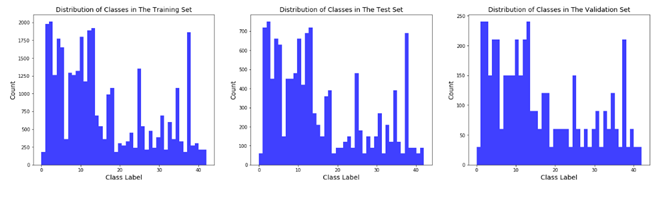
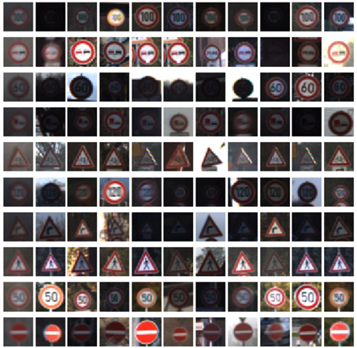
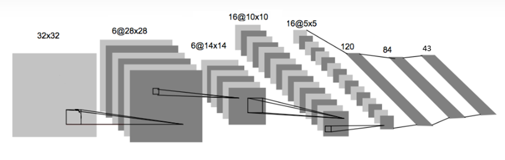
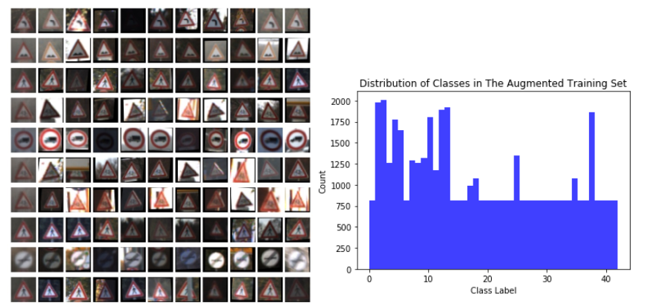
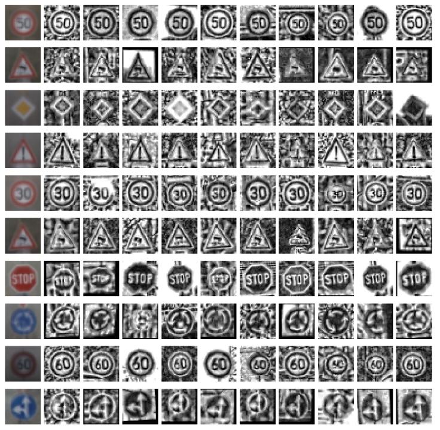
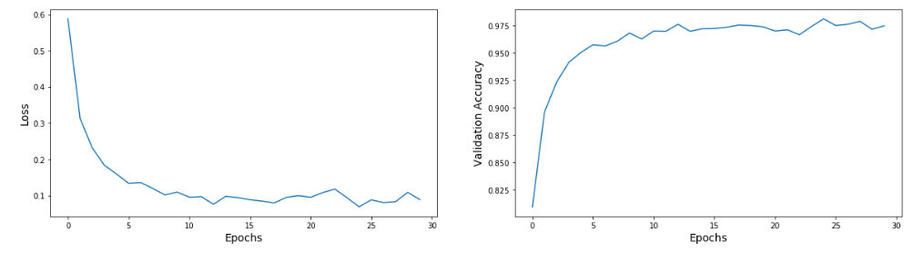
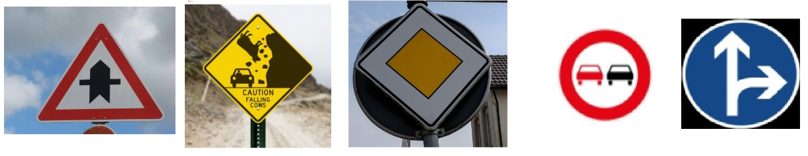
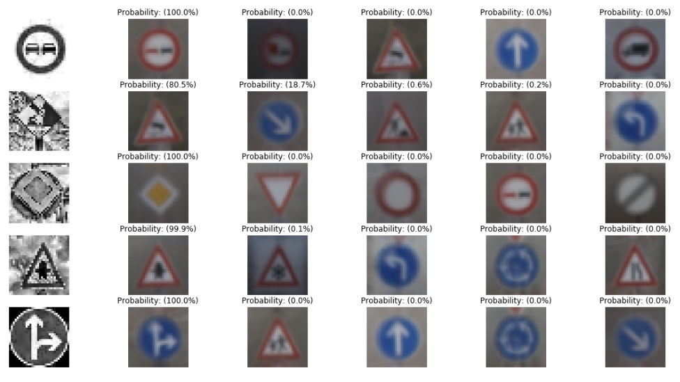

# Traffic-Sign-Classifier-Using-LeNet-5

## **Traffic Sign Classifier Using LeNet-5 Architecture**

**1.**  **Dataset Exploration:** German traffic sign dataset consists of 32x32 color images and 43 classes. There are 34799 training images,12630 test images and 4410 validation images.  Figure 1 shows the distribution of classes for the training, test, and validation sets.Figure 2 shows 10 example images for 10 random classes. The first column shows the mean image for the class. 

Figure 1 :Distribution of classes in the training, test and validation sets

 

Figure 2 :Sample images from the dataset

**2.** 	**Model Architecture:** This project uses LeNet-5 architecture, which has historically been a popular network for the MNIST data set.

Figure 3 :LeNet-5 Architecture

**3.** 	**Preprocessing:** 

**(i)Data normalization:** I originally simply normalized the dataset using _normalize_dataset(X_train)_ in Cell 6, and used learning rate = 0.001, EPOCHS = 30, BATCH_SIZE = 128. I also normalized the validation set. The network didn’t do so well -maximum validation accuracy was around 80%.

**(ii)Histogram Equalization:** In the normalized dataset there is still substantial variation in brightness of the images. I applied histogram equalization to each channel before normalizing the image using: _normalize_dataset(preprocess_dataset(X_train, option='color')) . _The network did better but still not close to 90%.

**(iii)Data Augmentation:** Class distribution clearly shows that there is an imbalance in the amount of images per class._ _I created new images for classes which have less than the average number of images per class using scaling, translation and warping operations implemented in [here](https://github.com/jeremy-shannon/CarND-Traffic-Sign-Classifier-Project).  The size of the augmented training set is 46714.

Figure 4 : Augmented data and the new class distribution for the training set

I also converted images to a single-Y channel before applying histogram equalization as suggested in [here](https://mc.ai/traffic-sign-recognition/)). The final set of preprocessing steps are in Cell 7 and  can be applied using the function _preprocess_dataset_new(X_train)._ Note that, test and validation sets also need to be preprocessed.

Figure 5 :Histogram equalization of Y-channel

The validation accuracy increased to around 95%. Finally, I added dropouts after the fully connecting layers with a 0.8 probability of keeping the weights. The final architecture looks like this: Conv → RELU → Max-Pool→ Conv→  RELU →  Max-Pool → Flatten→ Fully Connected → RELU → Dropout→ Fully Connected →  RELU→ Dropout→ Logits.  After training, the validation accuracy increased close to **98%.** Voila!

Figure 6 :Validation accuracy after adding dropouts

Increasing the validation accuracy further will require a larger or deeper network architecture. When I tested the final network on the test images, I got a test accuracy of **95.7%.** I’ll take it.

 
**4.** 	**Test On New Images:**    I found the following 5 images on the web to test the accuracy of the network. The second image on the left does not belong to any class in the training set. I was curious to see what the network would predict. 

Figure 7 :Test images found online

Test Accuracy = 80.000%

Class:9 - Prediction: 9

Class:44 - Prediction: 23

Class:12 - Prediction: 12

Class:11 - Prediction: 11

Class:36 - Prediction: 36

The test accuracy is lower than the accuracy of the test set as expected -- the second test image is not part of the original dataset and was predicted as “slippery road” sign. When I tried different sets of new images, I got varying results between 80-100%. The figure below shows the top 5 softmax probabilities for each image found on the web. It’s interesting to note that the prediction for the second image is somewhat close, in the sense that, there is a -45-degree object at the center of the image.

Figure 8 :Top 5 soft max output

Approaches taken to improve accuracy:

-Preprocessing:Normalized raw data -> 80%

-Preprocessing: Histogram Equalization -> 90%

-Data augmentation and Y-channel histogram equalization -> 95%

-Adding dropouts to fully connected layer outputs->98%

